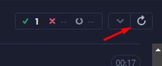

## Vytautas Matulevičius Automation task

# Steps to get the project running:
1. Install latest [Node.js ](https://nodejs.org/)
2. Clone the repo: "**git clone https://github.com/Veetoutas/Homework.git**"
3. Navigate to project directory
4. Install dependecies including Cypress: "**npm install**"
6. Open Cypress with terminal command: "**npx cypress open**"
7. Click "E2E Testing"
8. Choose "Chrome" and click "**Start E2E Testing in Chrome**"
9. Click on "home.cy.js" file
10. Test should start running
11. To re-run test click this button at the top left of Cypress Test Runner:

    

**P.S.** After step **4**  if you want to run tests without the Cypress runner UI you can simply use 
**npx cypress run** command in the terminal and it will return the result once the test is over :)
